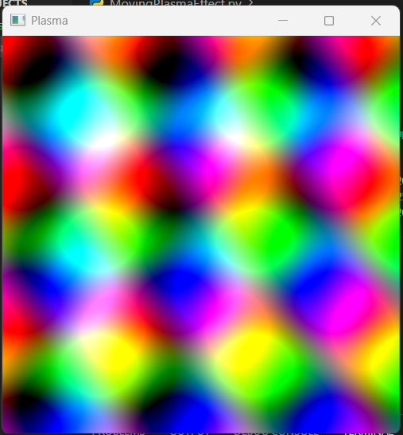

# Moving Plasma Effect

This is a small Python project that visualizes a colorful plasma effect using **NumPy** and **OpenCV**.

## Demo



## How to Run

1. Make sure you have Python installed (>=3.8 recommended).  
2. Install required packages:

```bash
pip install numpy opencv-python
